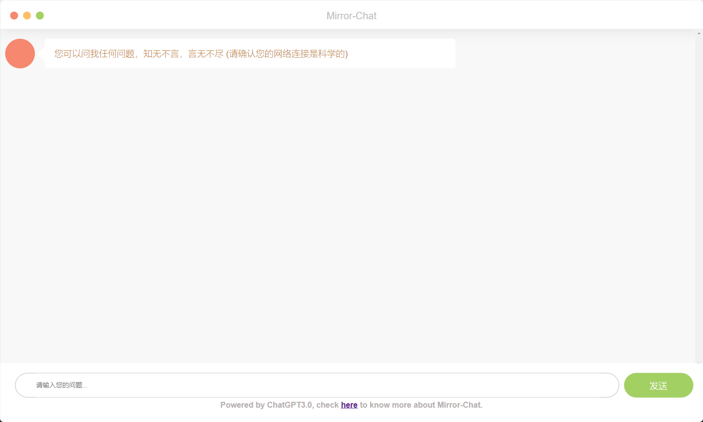

# Mirror-Chat
## Preview

## About Mirror-Chat
Mirror-Chat is an Intelligent conversation system whiich is based on ChatGPT3.0, it's able to think and reply most fo your questions such as the following scene:

- Writing an artile
- Fix bugs for your code
- Give you suggestions
- etc...
Mirror-Chat is growing, if you encounter any issues or get any ideas, welcome to write it down in the github [Mirror-Chat](https://github.com/ErikChanHub/Mirror-Chat/issues)

## About ChatGPT.
Open AI trained a model called ChatGPT which interacts in a conversational way.
The dialogue format makes it possible for ChatGPT to answer followup questions,
admit its mistakes, challenge incorrect premises, and reject inappropriate requests.

ChatGPT is a sibling model to InstructGPT, which is trained to follow an instruction in a prompt and provide a detailed response.We are excited to introduce ChatGPT to get users’ feedback and learn about its strengths and weaknesses. During the research preview, usage of ChatGPT is free. Try it now at chat.openai.com.

## How to donate
Please follow the steps below:

- scan the qrcode below with wechat
- input whatever you'd like
- finish donation
- Thanks for your donation, hope you a greate time in this journey.

